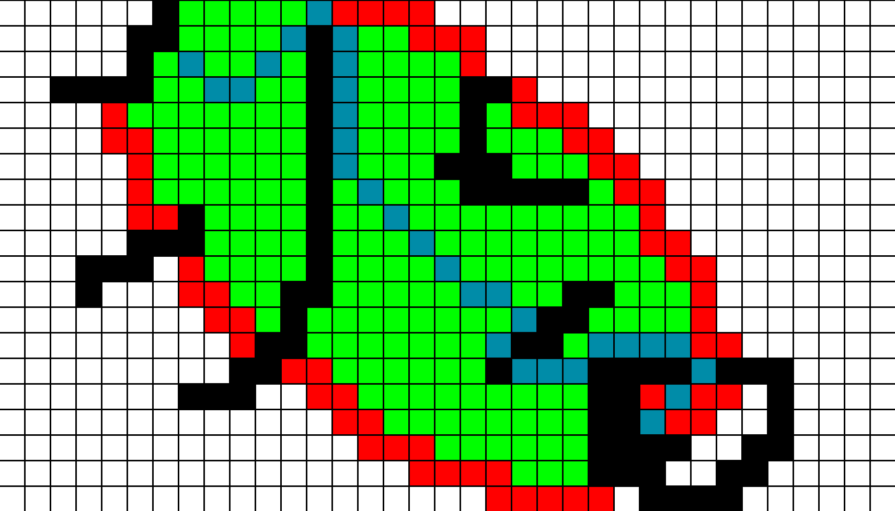

# A-Star-Path-Finding

## Description

This a basic A\* path finding algorithm visualizer made using PyGame.
You can draw walls and then see the algorithm find the shortest path from the start to the end.

## Table of Contents

- [Installation](#installation)
- [Usage](#usage)
- [Features](#features)
- [Contributing](#contributing)
- [License](#license)
- [Contact](#contact)
- [Acknowledgments](#acknowledgments)

## Installation

1. Clone the repo

   ```sh
   git clone https://github.com/Ekansh38/A-Star-Path-Finding.git

   ```

2. Install Dependencies

   ```sh
   pip install pygame

   pip3 install pygame

   python3 -m pip install pygame
   ```

3. Run the project
   ```sh
   python3 main.py
   ```

## Usage

You can use it to visualize the A\* path finding algorithm. You can draw walls and then see the algorithm find the shortest path from the start to the end.



## Features

- Draw walls
- Visualize the A\* path finding algorithm

## Contributing

I would love for anyone to contribute to this project and make it better in anyway possible. (because I am not that good at coding)

## License

Distributed under the MIT License. See LICENSE for more information.

## Contact

Ekansh - [Twitter or X](https://x.com/mister_byte_) - [YouTube Channel](https://www.youtube.com/@mister_byte_) - goenka.ekansh@gmail.com

## Acknowledgments

- [Pygame Documentation](https://www.pygame.org/docs/)
